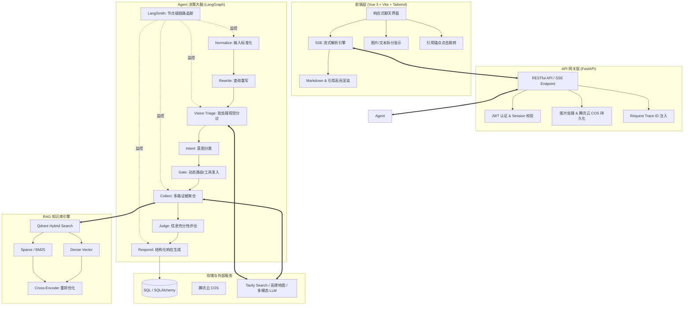
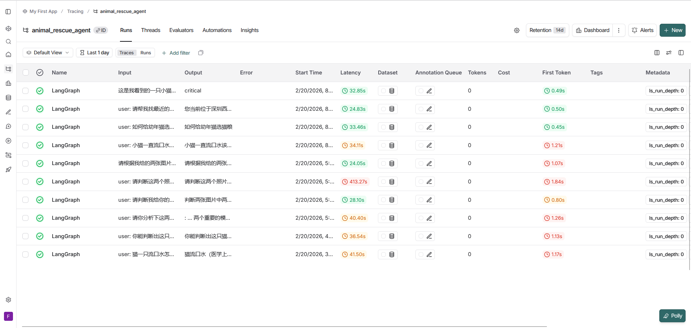
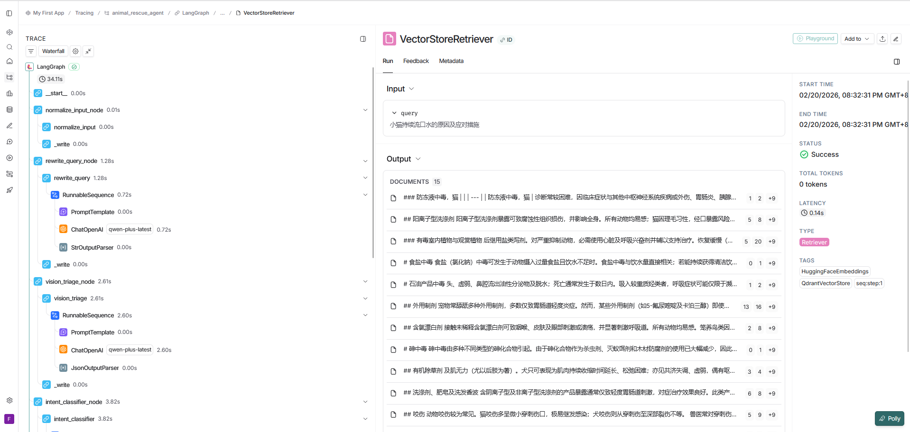

# 🐾 流浪动物救助智能问答平台 (Animal Rescue Agent)

> **"救助生命，科技同行"**。这是一个专为流浪动物救助场景打造的垂直领域 AI 助手。通过集成 LangGraph 智能体编排、多模态视觉分诊、RAG 专业知识库及实时联网搜索，本项目旨在为非专业救助者提供即时、专业、可落地的救援指导。

---

## 📖 项目全貌

流浪动物救助往往面临“信息差”与“时间差”。本项目通过 AI 技术，将复杂的动物医学知识与实时的线下救助资源整合，提供从**伤情评估**到**急救指导**再到**寻医问药**的一站式解决方案。

### 核心功能
- **📸 多模态伤情分诊**：支持上传多张现场照片，AI 自动识别物种（猫、狗、异宠等）、评估紧急程度（Critical/Common/Info）并检测致命红旗信号。支持单次请求批处理以优化性能。
- **📚 专业知识库检索 (RAG)**：基于《MSD 兽医手册》等权威资料，采用 Qdrant Hybrid 混合检索（Dense + Sparse）提供具备证据支撑的救助建议。
- **🌐 实时联网补全**：针对知识库未覆盖的最新资讯或特定物种信息，可通过网页搜索（Tavily）获取实时证据。
- **🗺️ 附近救助资源**：基于地理位置自动匹配最近的 24 小时宠物医院或流浪动物救助站（集成高德地图 API）。
- **📍 高精度引用体系**：所有结论均标注来源，前端支持点击引用直达参考资料卡片并高亮，杜绝 AI 幻觉。

---

## 🏗️ 系统架构

本项目采用解耦的分层架构，核心逻辑由智能体工作流驱动，配合高可用基础设施实现专业领域的问答。



---

## 🚀 核心技术点解析

### 1. 智能体编排 (Stateful Agent)
- **LangGraph 驱动**：不同于简单的线性 Chain，本项目使用图结构管理状态，支持 `sufficiency_judge` 节点在信息不足时引导回退或发起追问。
- **动态工具路由 (Gate Controller)**：根据紧急程度和意图动态决定是否调用耗时较长的联网搜索，确保急救场景下的秒级响应。

### 2. 高阶 RAG 体系
- **Hybrid 混合检索**：在 Qdrant 中同时存储稠密向量与稀疏向量，有效解决动物医学专有名词（如特定药品或病名）在语义空间中表征不准的问题。
- **物种感知过滤**：Vision 节点提取的物种信息会作为元数据过滤器 (Metadata Filter) 注入检索器，极大减少无关文档的干扰。

### 3. 可观测性与工程化
- **节点级监控 (Observability)**：通过 `trace_node` 装饰器，将每个 LangGraph 节点的状态、耗时及 LLM 原始 Payload 实时上报至 **LangSmith**。
- **鲁棒性设计**：整合了 `common.py` 工具库，采用更稳健的正则表达式提取 LLM 输出的 JSON，并对关键 API 调用做了详尽的异常捕获与兜底逻辑。

### 4. 极致交互与引用
- **引用体系**：后端通过 `[n]` 引用证据来源，前端通过正则动态将其转换为带有动画的高亮锚点，实现了“结论必有据”的闭环。
- **SSE 全链路流式**：从 LLM 生成到 API 传输再到前端渲染，全链路保持流式状态，消除用户等待焦虑。

---

## 🚀 快速开始

### 1. 环境准备
```bash
# 克隆项目
git clone <project-url>
cd animal_rescue_agent

# 安装依赖
pip install -r requirements.txt
```

### 2. 配置环境变量
项目根目录创建 `.env` 文件，关键配置项：

| 类别 | 变量名 | 说明 |
| :--- | :--- | :--- |
| **LLM** | `LLM_API_KEY` / `LLM_BASE_URL` | 主推理模型配置（OpenAI 兼容接口） |
| **视觉** | `VISION_API_KEY` / `VISION_MODEL` | 多模态模型（支持 Batch，如 qwen-vl-plus） |
| **向量库** | `QDRANT_URL` / `QDRANT_COLLECTION_NAME` | Qdrant 连接信息及集合名称 |
| **存储 (COS)** | `COS_SECRET_ID` / `COS_SECRET_KEY` / `COS_BUCKET` / `COS_REGION` | 腾讯云 COS 配置，用于图片持久化 |
| **外部 API** | `AMAP_API_KEY` / `TAVILY_API_KEY` | 高德地图与 Tavily 联网搜索 Key |
| **认证** | `SECRET_KEY` / `ALGORITHM` | JWT 签发密钥与加密算法 |
| **数据库** | `DATABASE_URL` | SQLAlchemy 业务库地址 |
| **监控** | `LANGCHAIN_TRACING_V2` / `LANGCHAIN_API_KEY` | LangSmith 开启开关 |

### 3. 运行服务
```bash
# 启动后端
python -m app.main

# 启动前端 (另开终端)
cd frontend
npm install
npm run dev
```

---

## 📂 项目结构

### 1. 后端核心 (`app/`)

- **`agent/`**: 智能体大脑，负责复杂的逻辑推理与工作流编排
  - `graph.py`: 基于 **LangGraph** 定义有状态的节点图，串联整个救助逻辑。
  - `state.py`: 定义全流程共享的状态结构 `AgentState`。
  - `prompts.py`: 集中化的提示词工程中心，包含分诊、重写、响应等模板。
  - `nodes/`: 节点原子实现，如 `vision_triage.py` (视觉分诊)、`collect_evidence.py` (多路检索) 等。
- **`api/`**: 基于 FastAPI 构建的 RESTful 接口层
  - `v1/`: 业务逻辑接口，包含 `rescue_stream.py` (SSE 实时流)、`auth.py` (用户认证) 等。
  - `schemas.py`: 严格的 Pydantic 数据模型定义，确保输入输出的类型安全。
  - `health.py`: 系统健康检查接口。
- **`knowledge_base/`**: 领域知识 RAG 引擎
  - `vector_store.py`: **Qdrant** 混合检索封装，集成 BM25 与 Dense 向量。
  - `retriever.py`: 实现多级检索策略，支持物种与紧急度过滤。
  - `reranker.py`: 引入重排模型优化搜索结果的相关性。
  - `scripts/`: 数据治理脚本集，包含 `crawl_and_prepare.py` (采集)、`sync_to_qdrant.py` (同步)。
- **`db/`**: 关系型数据库持久化 (SQLAlchemy)
  - `model.py`: 核心业务实体模型（用户、会话、图片元数据）。
  - `knowledge_model.py`: 知识库文档与其切片的映射模型。
- **`llm/`**: 大模型抽象层，屏蔽不同供应商接口差异，提供统一的 `get_llm()` 调用。
- **`mcp/`**: 模型上下文协议 (Model Context Protocol) 风格的工具集成
  - `map/`: 高德地图服务，处理经纬度解析与周边机构搜索。
  - `web_search/`: 联网搜索适配器，动态获取即时资讯。
- **`services/`**: 核心业务逻辑服务，如 `session_service.py` 负责会话的完整生命周期。
- **`utils/`**: 基础设施级工具
  - `common.py`: 包含鲁棒的 JSON 解析、文本清洗、紧急度归一化等高频函数。
  - `auth.py`: JWT 签发、校验及 OAuth2 密码流实现。
  - `fallback.py`: 关键服务中断时的应急预案模板。
- **`config.py`**: 基于 `pydantic-settings` 的全局配置管理，支持环境变量自动加载。
- **`main.py`**: 应用主入口，处理 **lifespan** 初始化、中间件配置及路由挂载。

### 2. 前端展示 (`frontend/`)

- **`src/components/`**: 响应式 UI 组件库
  - `ChatArea.vue`: 核心交互区，支持 Markdown、引用高亮、多模态消息拆分。
  - `Sidebar.vue`: 会话历史持久化展示与管理。
- **`src/services/api.js`**: 统一的 Fetch 封装与 **SSE (Server-Sent Events)** 协议解析引擎。
- **`src/App.vue`**: 应用骨架，负责全局状态管理、消息路由及图片上传回调。
- **`vite.config.js`**: 现代前端构建配置，处理 API 代理与资源优化。

---

## 🐳 Docker 一键部署

本项目支持使用 Docker Compose 快速构建并启动全栈环境（前端 + 后端 + 向量数据库）。

### 1. 准备工作
- 确保已安装 [Docker](https://docs.docker.com/get-docker/) 和 [Docker Compose](https://docs.docker.com/compose/install/)。
- 在项目根目录创建并配置 `.env` 文件（可参考 `.env.example`）。

### 2. 启动服务
在项目根目录下执行以下命令：
```bash
docker-compose up -d --build
```

### 3. 访问入口
- **前端 Web 界面**: [http://localhost:5173/](http://localhost:5173/)
- **后端 API 文档**: [http://localhost:8000/docs](http://localhost:8000/docs)
- **Qdrant 管理后台**: [http://localhost:6333/dashboard](http://localhost:6333/dashboard)
- **LangSmith监控后台**： [https://smith.langchain.com](https://smith.langchain.com)

### 4. 常用命令
- **查看运行状态**: `docker-compose ps`
- **查看后端日志**: `docker-compose logs -f backend`
- **停止并移除容器**: `docker-compose down`

---
## 📹 演示
### 系统演示视频
[【流浪动物救助智能问答平台演示】](https://www.bilibili.com/video/BV1GBf3BAEWh?t=46.4)

---

## 📊 可观测性与调试
本项目深度集成 **LangSmith**。开发者可以确切观测到每个 Agent 节点的：
- 内部 State 的全量变化
- 具体的 Prompt 渲染结果
- 外部工具调用的原始响应
- 节点执行耗时分析





---
⭐ **Animal Rescue Agent** 是我个人学习后的成果，欢迎大家批评指正。