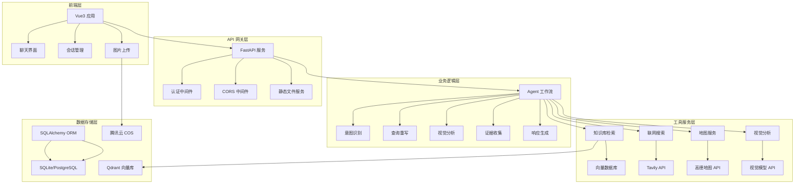

# 流浪动物救助智能问答平台

> 基于 FastAPI + LangChain + LangGraph + Vue3 的智能动物救助助手，支持多模态输入、知识库检索、联网搜索和地图服务。

## 🌟 项目特色

-[object Object]引擎**：基于 LangGraph 工作流，支持复杂推理和多工具协作
-[object Object]模态输入**：支持文字+图片混合输入，AI 视觉分析动物状况
- 📚 **专业知识库**：内置动物救助知识库，支持向量检索和语义匹配
- 🌐 **联网搜索**：实时获取最新救助信息和资源
- 🗺️ **地图服务**：基于地理位置推荐附近救助机构
-[object Object]**：SSE 实时流式输出，提升用户体验
- 👥 **多用户支持**：完整的用户认证和会话管理系统
- 📱 **响应式前端**：Vue3 + Vite 构建，支持移动端适配

## 🏗️ 系统架构



## 🚀 快速开始

### 环境要求

- Python 3.8+
- Node.js 16+
- Redis (可选，用于缓存)

### 1. 克隆项目

```bash
git clone <repository-url>
cd animal_rescue_agent
```

### 2. 后端配置

```bash
# 创建虚拟环境
python -m venv venv
source venv/bin/activate  # Windows: venv\Scripts\activate

# 安装依赖
pip install -r requirements.txt

# 配置环境变量
cp .env.example .env
# 编辑 .env 文件，填入必要的 API 密钥
```

### 3. 环境变量配置

创建 `.env` 文件并配置以下变量：

```env
# 应用基础配置
DEBUG=false
APP_NAME=动物救助平台

# LLM 配置
LLM_API_KEY=your_llm_api_key
LLM_MODEL=gpt-4
LLM_BASE_URL=https://api.openai.com/v1

# 数据库配置
DATABASE_URL=sqlite:///./data/app.db

# 向量数据库配置
VECTOR_DB_PATH=./data/vectors
EMBEDDING_MODEL=BAAI/bge-small-zh-v1.5
EMBEDDING_OFFLINE=true

# Qdrant 配置
QDRANT_URL=http://localhost:6333
QDRANT_COLLECTION_NAME=animal_rescue_collection

# 地图服务配置
AMAP_API_KEY=your_amap_api_key

# 联网搜索配置
TAVILY_API_KEY=your_tavily_api_key

# 视觉分析配置
VISION_BASE_URL=https://api.example.com
VISION_API_KEY=your_vision_api_key
VISION_MODEL=vision-model

# 腾讯云 COS 配置
COS_BASE_URL=https://your-bucket.cos.region.myqcloud.com
COS_SECRET_ID=your_cos_secret_id
COS_SECRET_KEY=your_cos_secret_key
COS_REGION=ap-beijing
COS_BUCKET=your-bucket-name

# 认证配置
SECRET_KEY=your-super-secret-key-change-in-production
ALGORITHM=HS256
ACCESS_TOKEN_EXPIRE_MINUTES=10080
```

### 4. 初始化数据库

```bash
# 启动应用会自动创建数据库表
python -m app.main
```

### 5. 前端配置

```bash
cd frontend

# 安装依赖
npm install

# 配置环境变量
echo "VITE_API_BASE_URL=http://localhost:8000" > .env.local

# 启动开发服务器
npm run dev
```

### 6. 启动服务

```bash
# 启动后端服务
python -m app.main

# 启动前端服务 (在另一个终端)
cd frontend && npm run dev
```

访问 http://localhost:5173 开始使用！

## 📁 项目结构

```
animal_rescue_agent/
├── app/                          # 后端主应用
│   ├── agent/                    # AI Agent 工作流
│   │   ├── graph.py             # LangGraph 工作流定义
│   │   ├── state.py             # Agent 状态管理
│   │   ├── prompts.py           # 提示词模板
│   │   └── nodes/               # 工作流节点
│   │       ├── intent_classifier.py    # 意图识别
│   │       ├── vision_triage.py        # 视觉分析
│   │       ├── collect_evidence.py     # 证据收集
│   │       ├── sufficiency_judge.py    # 充分性判断
│   │       └── respond.py              # 响应生成
│   ├── api/                       # API 路由
│   │   ├── v1/                   # API v1 版本
│   │   │   ├── auth.py           # 认证接口
│   │   │   ├── rescue.py         # 救助查询接口
│   │   │   ├── rescue_stream.py  # 流式查询接口
│   │   │   ├── session.py        # 会话管理接口
│   │   │   └── upload.py         # 文件上传接口
│   │   └── schemas.py            # API 数据模型
│   ├── db/                        # 数据库相关
│   │   ├── base.py               # 数据库连接
│   │   └── model.py              # 数据模型定义
│   ├── knowledge_base/            # 知识库管理
│   │   ├── vector_store.py       # 向量存储
│   │   ├── retriever.py          # 检索器
│   │   └── document_processor.py # 文档处理
│   ├── llm/                       # LLM 服务
│   │   ├── chat_model.py         # 聊天模型
│   │   └── base.py               # 基础配置
│   ├── mcp/                       # MCP 工具
│   │   ├── map/                  # 地图服务
│   │   └── web_search/           # 网络搜索
│   ├── services/                  # 业务服务
│   │   └── session_service.py    # 会话服务
│   ├── utils/                     # 工具函数
│   │   ├── auth.py               # 认证工具
│   │   ├── fallback.py           # 兜底响应
│   │   └── text.py               # 文本处理
│   ├── config.py                  # 应用配置
│   └── main.py                    # 应用入口
├── frontend/                      # 前端应用
│   ├── src/
│   │   ├── components/           # Vue 组件
│   │   │   ├── ChatArea.vue      # 聊天区域
│   │   │   ├── Sidebar.vue       # 侧边栏
│   │   │   └── LoginModal.vue    # 登录弹窗
│   │   ├── services/             # API 服务
│   │   │   └── api.js            # API 封装
│   │   ├── assets/               # 静态资源
│   │   ├── App.vue               # 主应用组件
│   │   ├── main.js               # 应用入口
│   │   └── style.css             # 全局样式
│   ├── package.json              # 前端依赖
│   └── vite.config.js            # Vite 配置
├── requirements.txt               # Python 依赖
├── .env.example                  # 环境变量示例
└── README.md                     # 项目文档
```

## 🔧 核心功能

### 1. 智能问答工作流

基于 LangGraph 构建的多步骤推理流程：

```python
# 工作流程
normalize_input → rewrite_query → vision_triage → intent_classifier 
→ gate → collect_evidence → sufficiency_judge → respond
```

- **输入标准化**：清理和预处理用户输入
- **查询重写**：优化查询语句，提高检索效果
- **视觉分析**：分析上传的动物图片，识别症状和紧急程度
- **意图识别**：判断用户意图（咨询、求助、紧急情况等）
- **智能路由**：根据意图选择合适的处理策略
- **证据收集**：从知识库、网络、地图等多源收集信息
- **充分性判断**：评估信息是否足够回答用户问题
- **响应生成**：生成专业、人性化的回答

### 2. 多模态输入支持

- **文字输入**：自然语言描述问题
- **图片上传**：支持 JPEG、PNG、WebP 格式，最大 5MB
- **混合输入**：文字+图片组合，AI 综合分析

### 3. 知识库检索

- **向量存储**：基于 Qdrant 的语义检索
- **混合检索**：关键词搜索 + 语义相似度
- **重排序**：基于相关性的结果重排序
- **动态扩展**：支持知识库内容更新

### 4. 地图服务集成

- **地理定位**：自动获取用户位置
- **附近机构**：搜索附近的动物医院、救助站
- **路线规划**：提供导航和联系方式
- **实时信息**：获取机构营业状态

### 5. 流式响应

- **SSE 技术**：Server-Sent Events 实时推送
- **逐字输出**：模拟真人对话体验
- **断线重连**：网络异常自动恢复
- **心跳检测**：保持连接稳定性

## 🔐 安全特性

- **JWT 认证**：安全的用户认证机制
- **密码加密**：bcrypt 哈希存储
- **文件校验**：上传文件类型和大小限制
- **CORS 配置**：跨域请求安全控制
- **输入验证**：Pydantic 模型验证
- **SQL 注入防护**：ORM 参数化查询

## 📊 API 文档

启动服务后访问以下地址查看完整 API 文档：

- **Swagger UI**: http://localhost:8000/docs
- **ReDoc**: http://localhost:8000/redoc

### 主要 API 端点

#### 认证相关
- `POST /api/v1/auth/register` - 用户注册
- `POST /api/v1/auth/login` - 用户登录
- `GET /api/v1/auth/me` - 获取当前用户信息

#### 会话管理
- `POST /api/v1/session/create` - 创建会话
- `GET /api/v1/session` - 获取会话列表
- `GET /api/v1/session/{id}` - 获取会话详情
- `PUT /api/v1/session/{id}/title` - 更新会话标题
- `DELETE /api/v1/session/{id}` - 删除会话
- `GET /api/v1/session/{id}/history` - 获取对话历史

#### 智能问答
- `POST /api/v1/query` - 普通问答接口
- `POST /api/v1/query/stream` - 流式问答接口

#### 文件上传
- `POST /api/v1/upload/image` - 上传图片

## 🛠️ 开发指南

### 后端开发

#### 添加新的 Agent 节点

1. 在 `app/agent/nodes/` 目录下创建新节点文件
2. 实现节点函数，接收 `AgentState` 参数
3. 在 `app/agent/graph.py` 中注册节点和边

```python
# 示例：新节点实现
async def new_node(state: AgentState) -> AgentState:
    # 处理逻辑
    state["result"] = "处理结果"
    return state
```

#### 添加新的 API 端点

1. 在 `app/api/v1/` 目录下创建路由文件
2. 定义 Pydantic 模型用于请求/响应
3. 在 `app/api/v1/__init__.py` 中注册路由

### 前端开发

#### 组件开发规范

- 使用 Composition API
- 统一错误处理
- 响应式设计
- 无障碍支持

#### API 调用示例

```javascript
import { rescueQueryStream } from './services/api'

// 流式查询
await rescueQueryStream({
  query: '我的猫生病了怎么办',
  enable_web_search: true,
  enable_map: true,
  onDelta: (data) => console.log(data.text),
  onDone: (meta) => console.log('完成', meta)
})
```

## 🧪 测试

### 后端测试

```bash
# 运行所有测试
python -m pytest

# 运行特定测试
python -m pytest tests/test_agent.py

# 生成覆盖率报告
python -m pytest --cov=app tests/
```

### 前端测试

```bash
cd frontend

# 运行单元测试
npm run test

# 运行端到端测试
npm run test:e2e
```

## 📦 部署

### Docker 部署

```dockerfile
# Dockerfile
FROM python:3.9-slim

WORKDIR /app
COPY requirements.txt .
RUN pip install -r requirements.txt

COPY . .
EXPOSE 8000

CMD ["uvicorn", "app.main:app", "--host", "0.0.0.0", "--port", "8000"]
```

```bash
# 构建镜像
docker build -t animal-rescue-api .

# 运行容器
docker run -p 8000:8000 animal-rescue-api
```

### 生产环境配置

1. **反向代理**：使用 Nginx 处理静态文件和负载均衡
2. **数据库**：使用 PostgreSQL 替代 SQLite
3. **缓存**：配置 Redis 缓存提升性能
4. **监控**：集成 Prometheus + Grafana
5. **日志**：使用 ELK Stack 收集日志

## 🤝 贡献指南

1. Fork 项目
2. 创建特性分支 (`git checkout -b feature/AmazingFeature`)
3. 提交更改 (`git commit -m 'Add some AmazingFeature'`)
4. 推送到分支 (`git push origin feature/AmazingFeature`)
5. 开启 Pull Request

## 📄 许可证

本项目采用 MIT 许可证 - 查看 [LICENSE](LICENSE) 文件了解详情

## 🙏 致谢

- [FastAPI](https://fastapi.tiangolo.com/) - 现代化的 Python Web 框架
- [LangGraph](https://langchain-ai.github.io/langgraph/) - 构建有状态的多参与者应用程序
- [Vue.js](https://vuejs.org/) - 渐进式 JavaScript 框架
- [Qdrant](https://qdrant.tech/) - 高性能向量相似性搜索引擎
- [Sentence Transformers](https://sbert.net/) - 最先进的句子嵌入

## 📞 联系我
- 邮箱：1871564132@qq.com
---

⭐ 如果这个项目对您有帮助，请给我们一个 Star！
